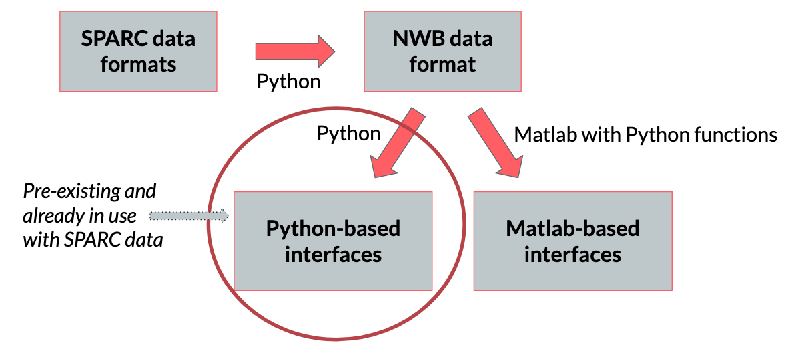

# sparc2nwb

### SPARC Data Conversion to NWB Format
1. The GitHub repository is proposed to convert data[1] into NWB format.
2. The NWB Format will be able to stor raw and processed data and associated metadata.
3. The NWB Format is not a rigid format and do not have a stable folder/data structure. The folder/data structure heavily depends on the process of experimentation and the data being collected in the experiments.
4. We will be working to convert files from json format to nwb format. Any other storage format such as xlsx or csv can be converted to json for further conversion to nwb.

### Description of Data
This project will convert data and metadata from an optophysiological study dataset [4] within the SPARC portal into NWB format. The study [5,6] aimed to characterize porcine and human neuronal responses to mechanical compression and tension using immunohisochemical techniques.

Converted data includes: 1) Timeframe (i.e., timestamp in frame number) and 2) Neuronal response (i.e., changes in fluorescence in response to stimulus)
Converted metadata includes: 1) Study subject ID, 2) Mehcanical stimulus type (i.e., stretch or compression), and 3) Specific neuron within a group that responded to stimulus. More descriptors can be added as metadata as needed.

### References
1. https://discover.pennsieve.io/datasets/99
2. https://github.com/SteinmetzLab/dataToNWB/tree/master/visualDiscriminationNeuropixels
3. https://pynwb.readthedocs.io/en/stable/
4. https://sparc.science/datasets/124?type=dataset&path=files
5. https://www.protocols.io/view/mechanosensitive-enteric-neurons-incidence-and-abu-bpcamise
6. https://www.nature.com/articles/s41598-020-70216-6
